<h2>브랜치란 무엇인가</h2>
> 브랜치란 무엇인가

- Git이 브랜치를 다루는 과정을 이해하려면 우선 Git이 데이터를 어떻게 저장하는지 알아야 한다.

    ```
    $ git add README test.rb LICENSE
    $ git commit -m 'The initial commit of my project'
    ```
    [gitCommitStructure]
    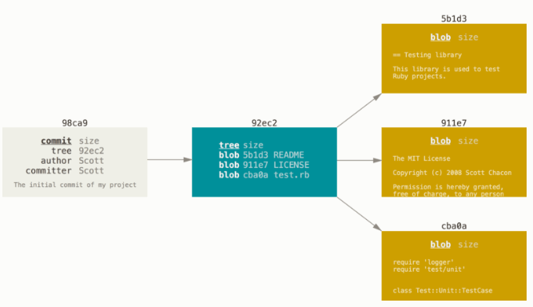
- 다시 파일을 수정하고 커밋하면 이전 커밋이 무엇인지도 저장한다.

    [gitPushStructure]
    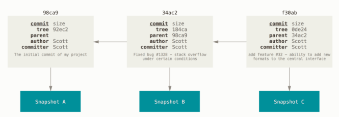

> 새 브랜치 생성하기
```
$ git branch testing
```
- Git은 'HEAD’라는 특수한 포인터가 있다. 이 포인터는 지금 작업하는 로컬 브랜치를 가리킨다.

    [workingForBranchToPointerHead]
    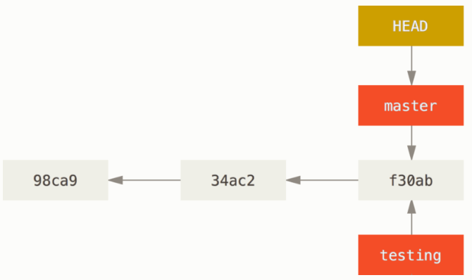

- git log 명령에 --decorate 옵션을 사용하면 쉽게 브랜치가 어떤 커밋을 가리키는지도 확인할 수 있다.
    ```
    $ git log --oneline --decorate
    f30ab (HEAD -> master, testing) add feature #32 - ability to add new formats to the central interface
    34ac2 Fixed bug #1328 - stack overflow under certain conditions
    98ca9 The initial commit of my project
    ```

> 브랜치 이동하기
- git checkout 명령으로 다른 브랜치로 이동할 수 있다. 
    ```
    $ git checkout testing
    ``` 

    [headFromTestingBranch]
    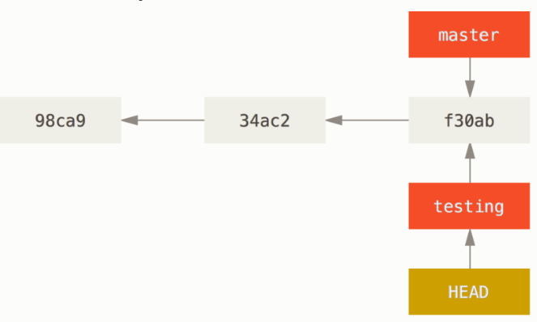
- 새로 만든 브랜치로 커밋을 해보자
    ```
    $ vim test.rb
    $ git commit -a -m 'made a change'
    ```
    [headFromTestingNewBranch]
    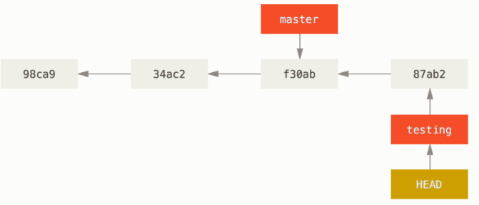
- 다시 master 브랜치로 돌아가보자
    ```
    $ git checkout master
    ```
    [headFromMasterBranch]
    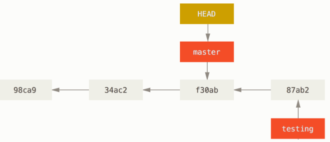
- 이처럼 브랜치간의 이동을 통해 브랜치 마다 각각 다른 일을 독립적으로 수행할 수 있다.
- 파일을 수정하고 다시 커밋을 해보자.
    ```
    $ vim test.rb
    $ git commit -a -m 'made other changes'
    ```
    [splitBranch]
    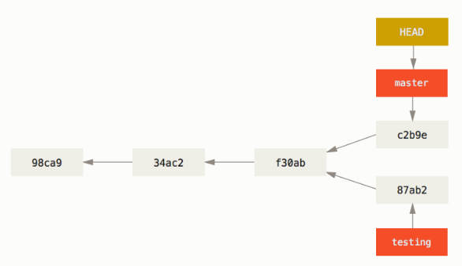
- `git log --oneline --decorate --graph --all`
    ```
    $ git log --oneline --decorate --graph --all
    * c2b9e (HEAD, master) made other changes
    | * 87ab2 (testing) made a change
    |/
    * f30ab add feature #32 - ability to add new formats to the
    * 34ac2 fixed bug #1328 - stack overflow under certain conditions
    * 98ca9 initial commit of my project
    ```


<h2>브랜치와 Merge 의 기초</h2>

- 실제 개발과정에서 겪을 만한 예제를 하나 살펴보자. 브랜치와 Merge는 보통 이런 식으로 진행한다.

    1. 웹사이트가 있고 뭔가 작업을 진행하고 있다.

    2. 새로운 이슈를 처리할 새 Branch를 하나 생성한다.

    3. 새로 만든 Branch에서 작업을 진행한다.

- 이때 중요한 문제가 생겨서 그것을 해결하는 Hotfix를 먼저 만들어야 한다. 그러면 아래와 같이 할 수 있다.

    1. 새로운 이슈를 처리하기 이전의 운영(Production) 브랜치로 이동한다.

    2. Hotfix 브랜치를 새로 하나 생성한다.

    3. 수정한 Hotfix 테스트를 마치고 운영 브랜치로 Merge 한다.

    4. 다시 작업하던 브랜치로 옮겨가서 하던 일 진행한다.
    
>브랜치의 기초
- 먼저 지금 작업하는 프로젝트에서 이전에 master 브랜치에 커밋을 몇 번 했다고 가정한다.
- 이슈 관리 시스템에 등록된 53번 이슈를 처리한다고 하면 이 이슈에 집중할 수 있는 브랜치를 새로 하나 만든다. 브랜치를 만들면서 Checkout까지 한 번에 하려면 git checkout 명령에 -b 라는 옵션을 추가한다.
    ```
    $ git checkout -b iss53
    Switched to a new branch "iss53"
    ```
- iss53 브랜치를 Checkout 했기 때문에(즉, HEAD 는 iss53 브랜치를 가리킨다) 뭔가 일을 하고 커밋하면 iss53 브랜치가 앞으로 나아간다.
    ```
    $ vim index.html
    $ git commit -a -m 'added a new footer [issue 53]'
    ```
    [workingIssu53Branch]

    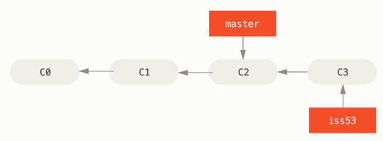
- 브랜치를 이동하려면 하여 해야 할 일이 있다면 작업하던 것을 모두 커밋하고 다른 브랜치로 옮긴다.
- Git은 자동으로 워킹 디렉토리에 파일들을 추가하고, 지우고, 수정해서 Checkout 한 브랜치의 마지막 스냅샷으로 되돌려 놓는다.
- 이젠 해결해야 할 핫픽스가 생겼을 때를 살펴보자. `hotfix`라는 브랜치를 만들고 새로운 이슈를 해결할 때까지 사용한다.
    ```
    $ git checkout -b hotfix
    Switched to a new branch 'hotfix'
    $ vim index.html
    $ git commit -a -m 'fixed the broken email address'
    [hotfix 1fb7853] fixed the broken email address
    1 file changed, 2 insertions(+)
    ```
     [masterBranchFromHotfixBranch]

    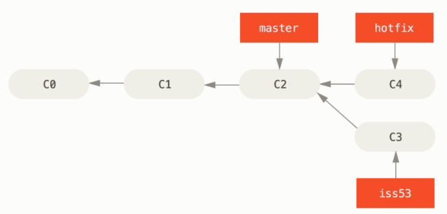
- 운영 환경에 적용하려면 문제를 제대로 고쳤는지 테스트하고 최종적으로 운영환경에 배포하기 위히 hotfix 브랜치를 master 브랜치에 합쳐야 한다. git merge 명령으로 아래와 같이 한다.
    ```
    $ git checkout master
    $ git merge hotfix
    Updating f42c576..3a0874c
    Fast-forward
    index.html | 2 ++
    1 file changed, 2 insertions(+)
    ```
    - hotfix 브랜치가 가리키는 C4 커밋이 C2 커밋에 기반한 브랜치이기 때문에 브랜치 포인터는 Merge 과정 없이 그저 최신 커밋으로 이동한다. 이런 Merge 방식을 “Fast forward” 라고 부른다. 
    [mergeAfterHofixFromMasterBranch]

    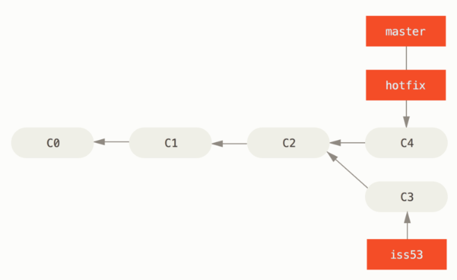
    
- 급한 문제를 해결하고 master 브랜치에 적용하고 나면 다시 일하던 브랜치로 돌아가야 한다. 이제 더 이상 필요없는 hotfix 브랜치는 삭제한다. git branch 명령에 -d 옵션을 주고 브랜치를 삭제한다.
    ```
    $ git branch -d hotfix
    Deleted branch hotfix (3a0874c).
    ```
    ```
    $ git checkout iss53
    Switched to branch "iss53"
    $ vim index.html
    $ git commit -a -m 'finished the new footer [issue 53]'
    [iss53 ad82d7a] finished the new footer [issue 53]
    1 file changed, 1 insertion(+)
    ```

>Merge 의 기초
- 53번 이슈를 다 구현하고 master 브랜치에 Merge 하는 과정을 살펴보자
    ```
    $ git checkout master
    Switched to branch 'master'
    $ git merge iss53
    Merge made by the 'recursive' strategy.
    index.html |    1 +
    1 file changed, 1 insertion(+)
    ```
- hotfix 를 Merge 했을 때와 메시지가 다르다. 현재 브랜치가 가리키는 커밋이 Merge 할 브랜치의 조상이 아니므로 Git은 'Fast-forward’로 Merge 하지 않는다. 이 경우에는 Git은 각 브랜치가 가리키는 커밋 두 개와 공통 조상 하나를 사용하여 3-way Merge를 한다.

     [threeCommitMerge]

    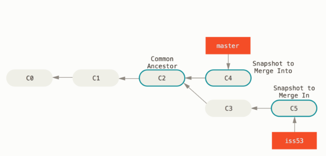
- 단순히 브랜치 포인터를 최신 커밋으로 옮기는 게 아니라 3-way Merge 의 결과를 별도의 커밋으로 만들고 나서 해당 브랜치가 그 커밋을 가리키도록 이동시킨다. 그래서 이런 커밋은 부모가 여러 개고 Merge 커밋이라고 부른다.

    [mergeCommit]

    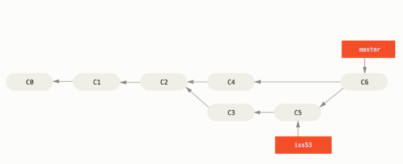
- iss53 브랜치를 master에 Merge 하고 나면 더는 iss53 브랜치가 필요 없다. 다음 명령으로 브랜치를 삭제하고 이슈의 상태를 처리 완료로 표시한다.
    ```
    $ git branch -d iss53
    ```

>충돌의 기초
- 53번 이슈와 hotfix 가 같은 부분을 수정했다면 Git은 Merge 하지 못하고 아래와 같은 충돌(Conflict) 메시지를 출력한다.
    ```
    $ git merge iss53
    Auto-merging index.html
    CONFLICT (content): Merge conflict in index.html
    Automatic merge failed; fix conflicts and then commit the result.
    ```
- Git이 어떤 파일을 Merge 할 수 없었는지 살펴보려면 git status 명령을 이용한다.
    ```
    $ git status
    On branch master
    You have unmerged paths.
    (fix conflicts and run "git commit")

    Unmerged paths:
    (use "git add <file>..." to mark resolution)

        both modified:      index.html

    no changes added to commit (use "git add" and/or "git commit -a")
    ```
- 충돌이 일어난 파일은 unmerged 상태로 표시된다. Git은 충돌이 난 부분을 표준 형식에 따라 표시해준다. 그러면 개발자는 해당 부분을 수동으로 해결한다. 충돌 난 부분은 아래와 같이 표시된다.
    ```
    <<<<<<< HEAD:index.html
    <div id="footer">contact : email.support@github.com</div>
    =======
    <div id="footer">
    please contact us at support@github.com
    </div>
    >>>>>>> iss53:index.html
    ```

<h2>브랜치 관리</h2>

>브랜치 관리
- 아무런 옵션 없이 실행하면 브랜치의 목록을 보여준다.
    ```
    $ git branch
    iss53
    * master
    testing
    ```
    - `*` 기호가 붙어 있는 master 브랜치는 현재 Checkout 해서 작업하는 브랜치를 나타낸다. 즉, 지금 수정한 내용을 커밋하면 master 브랜치에 커밋되고 포인터가 앞으로 한 단계 나아간다.
- git branch -v 명령을 실행하면 브랜치마다 마지막 커밋 메시지도 함께 보여준다.
    ```
    $ git branch -v
    iss53   93b412c fix javascript issue
    * master  7a98805 Merge branch 'iss53'
    testing 782fd34 add scott to the author list in the readmes
    ```
- 현재 Checkout 한 브랜치를 기준으로 --merged 와 --no-merged 옵션을 사용하여 Merge 된 브랜치인지 그렇지 않은지 필터링해 볼 수 있다.
- git branch --merged 명령으로 이미 Merge 한 브랜치 목록을 확인한다.
    ```
    $ git branch --merged
    iss53
    * master
    ```
    - iss53 브랜치는 앞에서 이미 Merge 했기 때문에 목록에 나타난다.
    - `*` 기호가 붙어 있지 않은 브랜치는 git branch -d 명령으로 삭제해도 되는 브랜치다. 이미 다른 브랜치와 Merge 했기 때문에 삭제해도 정보를 잃지 않는다.
- 반대로 현재 Checkout 한 브랜치에 Merge 하지 않은 브랜치를 살펴보려면 git branch --no-merged 명령을 사용한다.
    ```
    $ git branch --no-merged
    testing
    ```
    - 위에는 없었던 다른 브랜치가 보인다. 아직 Merge 하지 않은 커밋을 담고 있기 때문에 git branch -d 명령으로 삭제되지 않는다.
