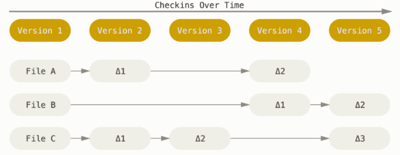
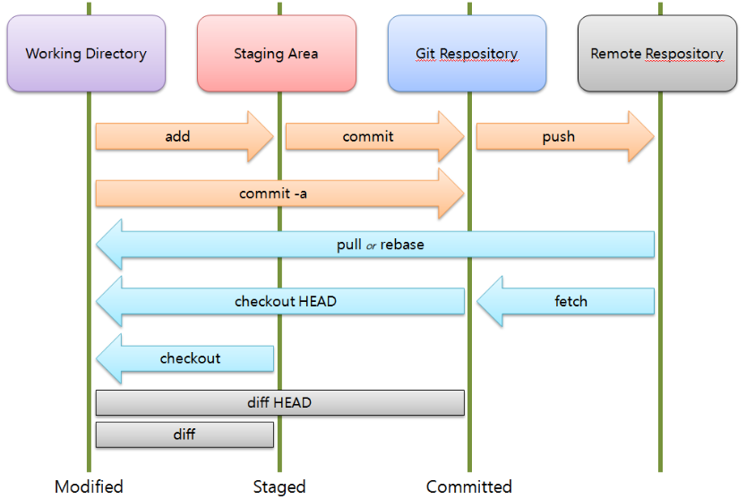
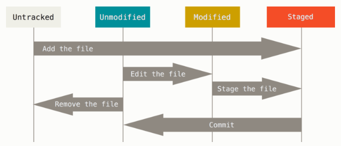

<h2>1. Git vs SVN</h2>

> Git은 시간 순으로 스냅샷을 저장, SVN은 파일에 대한 변화를 저장

[SVN]


[Git]


> Git의 무결성 
 - Git은 SHA-1 해시를 사용하여 체크섬을 만든다.  
   (ex.24b9da6552252987aa493b52f8696cd6d3b00373)

 - 실제로 Git은 파일을 이름으로 저장하지 않고 해당 파일의 해시로 저장

> Git의 세가지 상태 
 - Committed란 데이터가 로컬 데이터베이스에 안전하게 저장됐다는 것을 의미
 - Modified는 수정한 파일을 아직 로컬 데이터베이스에 커밋하지 않은 것을 말
 - Staged란 현재 수정한 파일을 곧 커밋할 것이라고 표시한 상태를 의미
    
    


<h2>2. Git 저장소 만들기</h2>

> 기존 디렉토리를 Git 저장소로 만들기

```
$ git init
$ git add *.c
$ git add LICENSE
$ git commit -m 'initial project version'
```

>기존 저장소를 Clone 하기

```
$ git clone https://github.com/Bziaco/TIL/tree/master/Git
```

<h2>3.  수정하고 저장소에 저장하기</h2>

> 파일의 라이프사이클
- 처음 저장소를 Clone 하면 모든 파일은 Tracked이면서 Unmodified 상태

    

>파일의 상태 확인하기

```
$ git status
On branch master
Your branch is up-to-date with 'origin/master'.
nothing to commit, working directory clean
```
- 위의 내용은 파일을 하나도 수정하지 않았다는 것을 말해준다. 
```
$ echo 'My Project' > README
$ git status
On branch master
Your branch is up-to-date with 'origin/master'.
Untracked files:
  (use "git add <file>..." to include in what will be committed)

    README

nothing added to commit but untracked files present (use "git add" to track)
```
- README 파일은 “Untracked files” 부분에 속해 있는데 이것은 README 파일이 Untracked 상태라는 것을 말한다.


>파일을 새로 추적하기
```
$ git add README
```

```
$ git status
On branch master
Your branch is up-to-date with 'origin/master'.
Changes to be committed:
(use "git reset HEAD <file>..." to unstage)

    new file:   README
```
- git status 명령을 다시 실행하면 README 파일이 Tracked 상태이면서 커밋에 추가될 Staged 상태라는 것을 확인할 수 있다.

> Modified 상태의 파일을 Stage 하기
```
$ git status
On branch master
Your branch is up-to-date with 'origin/master'.
Changes to be committed:
  (use "git reset HEAD <file>..." to unstage)

    new file:   README

Changes not staged for commit:
  (use "git add <file>..." to update what will be committed)
  (use "git checkout -- <file>..." to discard changes in working directory)

    modified:   CONTRIBUTING.md
```

> 파일 무시하기
```
$ cat .gitignore
*.[oa]
*~
```
- 보통 로그 파일이나 빌드 시스템이 자동으로 생성한 파일이 그렇다. 그런 파일을 무시하려면 .gitignore 파일을 만들고 그 안에 무시할 파일 패턴을 적는다.
- 패턴작성 참고 https://git-scm.com/book/ko/v2/Git%EC%9D%98-%EA%B8%B0%EC%B4%88-%EC%88%98%EC%A0%95%ED%95%98%EA%B3%A0-%EC%A0%80%EC%9E%A5%EC%86%8C%EC%97%90-%EC%A0%80%EC%9E%A5%ED%95%98%EA%B8%B0

> Staged와 Unstaged 상태의 변경 내용을 보기
- 꼭 잊지 말아야 할 것이 있는데 git diff 명령은 마지막으로 커밋한 후에 수정한 것들 전부를 보여주지 않는다. git diff 는 Unstaged 상태인 것들만 보여준다. 
```
$ git diff
diff --git a/CONTRIBUTING.md b/CONTRIBUTING.md
index 8ebb991..643e24f 100644
--- a/CONTRIBUTING.md
+++ b/CONTRIBUTING.md
@@ -65,7 +65,8 @@ branch directly, things can get messy.
 Please include a nice description of your changes when you submit your PR;
 if we have to read the whole diff to figure out why you're contributing
 in the first place, you're less likely to get feedback and have your change
-merged in.
+merged in. Also, split your changes into comprehensive chunks if your patch is
+longer than a dozen lines.

 If you are starting to work on a particular area, feel free to submit a PR
 that highlights your work in progress (and note in the PR title that it's
 ```
 - 이 명령은 워킹 디렉토리에 있는 것과 Staging Area에 있는 것을 비교한다. 그래서 수정하고 아직 Stage 하지 않은 것을 보여준다.
 ```
 $ git diff --staged
diff --git a/README b/README
new file mode 100644
index 0000000..03902a1
--- /dev/null
+++ b/README
@@ -0,0 +1 @@
+My Project
```
- 만약 커밋하려고 Staging Area에 넣은 파일의 변경 부분을 보고 싶으면 git diff --staged 옵션을 사용한다. 이 명령은 저장소에 커밋한 것과 Staging Area에 있는 것을 비교한다.

>변경사항 커밋하기
```
git commit -m "first commit"
```

>Staging Area 생략하기
```
$ git commit -a -m 'added new benchmarks'
[master 83e38c7] added new benchmarks
 1 file changed, 5 insertions(+), 0 deletions(-)
 ```

 >파일 삭제하기
 - Git에서 파일을 제거하려면 git rm 명령으로 Tracked 상태의 파일을 삭제한 후에(정확하게는 Staging Area에서 삭제하는 것) 커밋해야 한다. 이 명령은 워킹 디렉토리에 있는 파일도 삭제하기 때문에 실제로 파일도 지워진다.

 ```
 $ rm PROJECTS.md
$ git status
On branch master
Your branch is up-to-date with 'origin/master'.
Changes not staged for commit:
  (use "git add/rm <file>..." to update what will be committed)
  (use "git checkout -- <file>..." to discard changes in working directory)

        deleted:    PROJECTS.md

no changes added to commit (use "git add" and/or "git commit -a")
```
- Git 명령을 사용하지 않고 단순히 워킹 디렉터리에서 파일을 삭제하고 git status 명령으로 상태를 확인하면 Git은 현재 “Changes not staged for commit” (즉, Unstaged 상태)라고 표시해준다.
```
$ git rm PROJECTS.md
rm 'PROJECTS.md'
$ git status
On branch master
Your branch is up-to-date with 'origin/master'.
Changes to be committed:
  (use "git reset HEAD <file>..." to unstage)

    deleted:    PROJECTS.md
```
- 그리고 git rm 명령을 실행하면 삭제한 파일은 Staged 상태가 된다.
- 이미 파일을 수정했거나 Staging Area에(역주 - Git Index라고도 부른다) 추가했다면 -f 옵션을 주어 강제로 삭제해야 한다.

```
$ git rm --cached README
```
- Staging Area에서만 제거하고 워킹 디렉토리에 있는 파일은 지우지 않고 남겨둘 수 있다. 다시 말해서 하드디스크에 있는 파일은 그대로 두고 Git만 추적하지 않게 한다. 이것은 .gitignore 파일에 추가하는 것을 빼먹었거나 대용량 로그 파일이나 컴파일된 파일인 .a 파일 같은 것을 실수로 추가했을 때 쓴다. --cached 옵션을 사용하여 명령을 실행한다.
```
$ git rm log/\*.log
```
- '*' 앞에 \ 을 사용한 것을 기억하자. 파일명 확장 기능은 쉘에만 있는 것이 아니라 Git 자체에도 있기 때문에 필요하다. 이 명령은 log/ 디렉토리에 있는 .log 파일을 모두 삭제한다. 아래의 예제처럼 할 수도 있다.
```
$ git rm \*~
```
- 이 명령은 ~ 로 끝나는 파일을 모두 삭제한다.
>파일 이름 변경하기
```
$ git mv file_from file_to
```