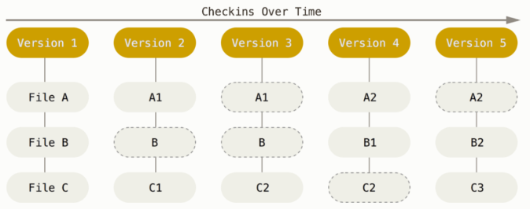

<h2>1. Git vs SVN</h2>

> Git은 시간 순으로 스냅샷을 저장, SVN은 파일에 대한 변화를 저장

[SVN]


[Git]



> Git의 무결성 
 - Git은 SHA-1 해시를 사용하여 체크섬을 만든다.  
   (ex.24b9da6552252987aa493b52f8696cd6d3b00373)

 - 실제로 Git은 파일을 이름으로 저장하지 않고 해당 파일의 해시로 저장

> Git의 세가지 상태 
 - Committed란 데이터가 로컬 데이터베이스에 안전하게 저장됐다는 것을 의미
 - Modified는 수정한 파일을 아직 로컬 데이터베이스에 커밋하지 않은 것을 말
 - Staged란 현재 수정한 파일을 곧 커밋할 것이라고 표시한 상태를 의미
    
    


<h2>2. Git 저장소 만들기</h2>

> 기존 디렉토리를 Git 저장소로 만들기

```
$ git init
$ git add *.c
$ git add LICENSE
$ git commit -m 'initial project version'
```

>기존 저장소를 Clone 하기

```
$ git clone https://github.com/Bziaco/TIL/tree/master/Git
```

<h2>3.  수정하고 저장소에 저장하기</h2>

> 파일의 라이프사이클
- 처음 저장소를 Clone 하면 모든 파일은 Tracked이면서 Unmodified 상태

    

>파일의 상태 확인하기

```
$ git status
On branch master
Your branch is up-to-date with 'origin/master'.
nothing to commit, working directory clean
```
- 위의 내용은 파일을 하나도 수정하지 않았다는 것을 말해준다. 
```
$ echo 'My Project' > README
$ git status
On branch master
Your branch is up-to-date with 'origin/master'.
Untracked files:
  (use "git add <file>..." to include in what will be committed)

    README

nothing added to commit but untracked files present (use "git add" to track)
```
- README 파일은 “Untracked files” 부분에 속해 있는데 이것은 README 파일이 Untracked 상태라는 것을 말한다.


>파일을 새로 추적하기
```
$ git add README
```

```
$ git status
On branch master
Your branch is up-to-date with 'origin/master'.
Changes to be committed:
(use "git reset HEAD <file>..." to unstage)

    new file:   README
```
- git status 명령을 다시 실행하면 README 파일이 Tracked 상태이면서 커밋에 추가될 Staged 상태라는 것을 확인할 수 있다.

> Modified 상태의 파일을 Stage 하기
```
$ git status
On branch master
Your branch is up-to-date with 'origin/master'.
Changes to be committed:
  (use "git reset HEAD <file>..." to unstage)

    new file:   README

Changes not staged for commit:
  (use "git add <file>..." to update what will be committed)
  (use "git checkout -- <file>..." to discard changes in working directory)

    modified:   CONTRIBUTING.md
```

> 파일 무시하기
```
$ cat .gitignore
*.[oa]
*~
```
- 보통 로그 파일이나 빌드 시스템이 자동으로 생성한 파일이 그렇다. 그런 파일을 무시하려면 .gitignore 파일을 만들고 그 안에 무시할 파일 패턴을 적는다.
- 패턴작성 참고 https://git-scm.com/book/ko/v2/Git%EC%9D%98-%EA%B8%B0%EC%B4%88-%EC%88%98%EC%A0%95%ED%95%98%EA%B3%A0-%EC%A0%80%EC%9E%A5%EC%86%8C%EC%97%90-%EC%A0%80%EC%9E%A5%ED%95%98%EA%B8%B0

> Staged와 Unstaged 상태의 변경 내용을 보기
- 꼭 잊지 말아야 할 것이 있는데 git diff 명령은 마지막으로 커밋한 후에 수정한 것들 전부를 보여주지 않는다. git diff 는 Unstaged 상태인 것들만 보여준다. 
```
$ git diff
diff --git a/CONTRIBUTING.md b/CONTRIBUTING.md
index 8ebb991..643e24f 100644
--- a/CONTRIBUTING.md
+++ b/CONTRIBUTING.md
@@ -65,7 +65,8 @@ branch directly, things can get messy.
 Please include a nice description of your changes when you submit your PR;
 if we have to read the whole diff to figure out why you're contributing
 in the first place, you're less likely to get feedback and have your change
-merged in.
+merged in. Also, split your changes into comprehensive chunks if your patch is
+longer than a dozen lines.

 If you are starting to work on a particular area, feel free to submit a PR
 that highlights your work in progress (and note in the PR title that it's
 ```
 - 이 명령은 워킹 디렉토리에 있는 것과 Staging Area에 있는 것을 비교한다. 그래서 수정하고 아직 Stage 하지 않은 것을 보여준다.
 ```
 $ git diff --staged
diff --git a/README b/README
new file mode 100644
index 0000000..03902a1
--- /dev/null
+++ b/README
@@ -0,0 +1 @@
+My Project
```
- 만약 커밋하려고 Staging Area에 넣은 파일의 변경 부분을 보고 싶으면 git diff --staged 옵션을 사용한다. 이 명령은 저장소에 커밋한 것과 Staging Area에 있는 것을 비교한다.

>변경사항 커밋하기
```
git commit -m "first commit"
```

>Staging Area 생략하기
```
$ git commit -a -m 'added new benchmarks'
[master 83e38c7] added new benchmarks
 1 file changed, 5 insertions(+), 0 deletions(-)
 ```

 >파일 삭제하기
 - Git에서 파일을 제거하려면 git rm 명령으로 Tracked 상태의 파일을 삭제한 후에(정확하게는 Staging Area에서 삭제하는 것) 커밋해야 한다. 이 명령은 워킹 디렉토리에 있는 파일도 삭제하기 때문에 실제로 파일도 지워진다.

 ```
 $ rm PROJECTS.md
$ git status
On branch master
Your branch is up-to-date with 'origin/master'.
Changes not staged for commit:
  (use "git add/rm <file>..." to update what will be committed)
  (use "git checkout -- <file>..." to discard changes in working directory)

        deleted:    PROJECTS.md

no changes added to commit (use "git add" and/or "git commit -a")
```
- Git 명령을 사용하지 않고 단순히 워킹 디렉터리에서 파일을 삭제하고 git status 명령으로 상태를 확인하면 Git은 현재 “Changes not staged for commit” (즉, Unstaged 상태)라고 표시해준다.
```
$ git rm PROJECTS.md
rm 'PROJECTS.md'
$ git status
On branch master
Your branch is up-to-date with 'origin/master'.
Changes to be committed:
  (use "git reset HEAD <file>..." to unstage)

    deleted:    PROJECTS.md
```
- 그리고 git rm 명령을 실행하면 삭제한 파일은 Staged 상태가 된다.
- 이미 파일을 수정했거나 Staging Area에(역주 - Git Index라고도 부른다) 추가했다면 -f 옵션을 주어 강제로 삭제해야 한다.

```
$ git rm --cached README
```
- Staging Area에서만 제거하고 워킹 디렉토리에 있는 파일은 지우지 않고 남겨둘 수 있다. 다시 말해서 하드디스크에 있는 파일은 그대로 두고 Git만 추적하지 않게 한다. 이것은 .gitignore 파일에 추가하는 것을 빼먹었거나 대용량 로그 파일이나 컴파일된 파일인 .a 파일 같은 것을 실수로 추가했을 때 쓴다. --cached 옵션을 사용하여 명령을 실행한다.
```
$ git rm log/\*.log
```
- '*' 앞에 \ 을 사용한 것을 기억하자. 파일명 확장 기능은 쉘에만 있는 것이 아니라 Git 자체에도 있기 때문에 필요하다. 이 명령은 log/ 디렉토리에 있는 .log 파일을 모두 삭제한다. 아래의 예제처럼 할 수도 있다.
```
$ git rm \*~
```
- 이 명령은 ~ 로 끝나는 파일을 모두 삭제한다.
>파일 이름 변경하기
```
$ git mv file_from file_to
```

<h2>4.  커밋 히스토리 조회하기</h2>

>커밋 히스토리 조회하기
```
$ git clone https://github.com/schacon/simplegit-progit

$ git log
commit ca82a6dff817ec66f44342007202690a93763949
Author: Scott Chacon <schacon@gee-mail.com>
Date:   Mon Mar 17 21:52:11 2008 -0700

    changed the version number

commit 085bb3bcb608e1e8451d4b2432f8ecbe6306e7e7
Author: Scott Chacon <schacon@gee-mail.com>
Date:   Sat Mar 15 16:40:33 2008 -0700

    removed unnecessary test

commit a11bef06a3f659402fe7563abf99ad00de2209e6
Author: Scott Chacon <schacon@gee-mail.com>
Date:   Sat Mar 15 10:31:28 2008 -0700

    first commit
```
- 커밋 히스토리를 시간순으로 보여준다. 즉, 가장 최근의 커밋이 가장 먼저 나온다. 
- 각 커밋의 SHA-1 체크섬, 저자 이름, 저자 이메일, 커밋한 날짜, 커밋 메시지를 보여준다.
- 여러 옵션 중 -p, --patch 는 굉장히 유용한 옵션이다. -p 는 각 커밋의 diff 결과를 보여준다. 다른 유용한 옵션으로 `-2`가 있는데 최근 두 개의 결과만 보여주는 옵션이다.
```
$ git log -p -2
commit ca82a6dff817ec66f44342007202690a93763949
Author: Scott Chacon <schacon@gee-mail.com>
Date:   Mon Mar 17 21:52:11 2008 -0700

    changed the version number

diff --git a/Rakefile b/Rakefile
index a874b73..8f94139 100644
--- a/Rakefile
+++ b/Rakefile
@@ -5,7 +5,7 @@ require 'rake/gempackagetask'
 spec = Gem::Specification.new do |s|
     s.platform  =   Gem::Platform::RUBY
     s.name      =   "simplegit"
-    s.version   =   "0.1.0"
+    s.version   =   "0.1.1"
     s.author    =   "Scott Chacon"
     s.email     =   "schacon@gee-mail.com"
     s.summary   =   "A simple gem for using Git in Ruby code."

commit 085bb3bcb608e1e8451d4b2432f8ecbe6306e7e7
Author: Scott Chacon <schacon@gee-mail.com>
Date:   Sat Mar 15 16:40:33 2008 -0700

    removed unnecessary test

diff --git a/lib/simplegit.rb b/lib/simplegit.rb
index a0a60ae..47c6340 100644
--- a/lib/simplegit.rb
+++ b/lib/simplegit.rb
@@ -18,8 +18,3 @@ class SimpleGit
     end

 end
-
-if $0 == __FILE__
-  git = SimpleGit.new
-  puts git.show
-end
```
- --stat 옵션으로 각 커밋의 통계 정보를 조회할 수 있다.
- --stat 옵션은 어떤 파일이 수정됐는지, 얼마나 많은 파일이 변경됐는지, 또 얼마나 많은 라인을 추가하거나 삭제했는지 보여준다. 요약정보는 가장 뒤쪽에 보여준다.
```
$ git log --stat
commit ca82a6dff817ec66f44342007202690a93763949
Author: Scott Chacon <schacon@gee-mail.com>
Date:   Mon Mar 17 21:52:11 2008 -0700

    changed the version number

 Rakefile | 2 +-
 1 file changed, 1 insertion(+), 1 deletion(-)

commit 085bb3bcb608e1e8451d4b2432f8ecbe6306e7e7
Author: Scott Chacon <schacon@gee-mail.com>
Date:   Sat Mar 15 16:40:33 2008 -0700

    removed unnecessary test

 lib/simplegit.rb | 5 -----
 1 file changed, 5 deletions(-)

commit a11bef06a3f659402fe7563abf99ad00de2209e6
Author: Scott Chacon <schacon@gee-mail.com>
Date:   Sat Mar 15 10:31:28 2008 -0700

    first commit

 README           |  6 ++++++
 Rakefile         | 23 +++++++++++++++++++++++
 lib/simplegit.rb | 25 +++++++++++++++++++++++++
 3 files changed, 54 insertions(+)
```
- --pretty 옵션은 히스토리 내용을 보여줄 때 기본 형식 이외에 여러 가지 중에 하나를 선택할 수 있다. 몇개 선택할 수 있는 옵션의 값이 있다. oneline 옵션은 각 커밋을 한 라인으로 보여준다. 이 옵션은 많은 커밋을 한 번에 조회할 때 유용하다.
```
$ git log --pretty=oneline
ca82a6dff817ec66f44342007202690a93763949 changed the version number
085bb3bcb608e1e8451d4b2432f8ecbe6306e7e7 removed unnecessary test
a11bef06a3f659402fe7563abf99ad00de2209e6 first commit
```
- format 옵션은 나만의 포맷으로 결과를 출력하고 싶을 때 사용한다. 특히 결과를 다른 프로그램으로 파싱하고자 할 때 유용하다.
```
$ git log --pretty=format:"%h - %an, %ar : %s"
ca82a6d - Scott Chacon, 6 years ago : changed the version number
085bb3b - Scott Chacon, 6 years ago : removed unnecessary test
a11bef0 - Scott Chacon, 6 years ago : first commit
```
- 옵션 참고 [history_preety_format](./reference/history_preety_format.md)
- 옵션 참고 [history_log](./reference/history_log.md)
 - 저자는 원래 작업을 수행한 원작자이고 커밋터는 마지막으로 이 작업을 적용한(저장소에 포함시킨) 사람이다.
 - oneline 옵션과 format 옵션은 --graph 옵션과 함께 사용할 때 더 빛난다. 이 명령은 브랜치와 머지 히스토리를 보여주는 아스키 그래프를 출력한다.
 ```
 $ git log --pretty=format:"%h %s" --graph
* 2d3acf9 ignore errors from SIGCHLD on trap
*  5e3ee11 Merge branch 'master' of git://github.com/dustin/grit
|\
| * 420eac9 Added a method for getting the current branch.
* | 30e367c timeout code and tests
* | 5a09431 add timeout protection to grit
* | e1193f8 support for heads with slashes in them
|/
* d6016bc require time for xmlschema
*  11d191e Merge branch 'defunkt' into local
 ```

 >조회 제한조건
- 옵션 참고 [history_limit_range](./reference/history_limit_range.md)
- --since 나 --until 같은 시간을 기준으로 조회하는 옵션은 매우 유용하다. 지난 2주 동안 만들어진 커밋들만 조회하는 명령은 아래와 같다.
```
$ git log --since=2.weeks
```
- 이 옵션은 다양한 형식을 지원한다."2008-01-15" 같이 정확한 날짜도 사용할 수 있고 "2 years 1 day 3 minutes ago" 같이 상대적인 기간을 사용할 수도 있다.
- 또 다른 기준도 있다. --author 옵션으로 저자를 지정하여 검색할 수도 있고 --grep 옵션으로 커밋 메시지에서 키워드를 검색할 수도 있다.
- --author와 --grep 옵션을 함께 사용하여 모두 만족하는 커밋을 찾으려면 --all-match 옵션도 반드시 함께 사용해야 한다.
- 정말 유용한 옵션으로는 -S 가 있는데 이 옵션은 코드에서 추가되거나 제거된 내용 중에 특정 텍스트가 포함되어 있는지를 검색한다. 예를 들어 어떤 함수가 추가되거나 제거된 커밋만을 찾아보려면 아래와 같은 명령을 사용한다.
```
$ git log -S function_name
```
